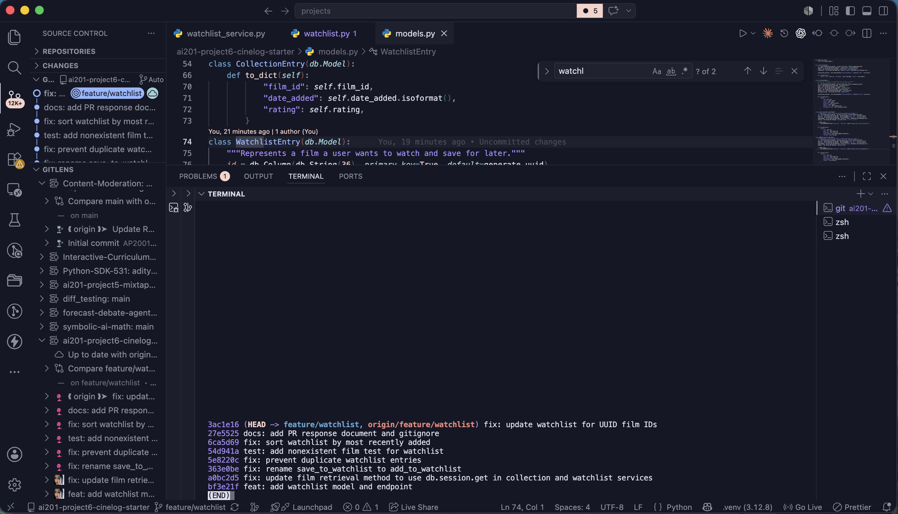

# PR Response Doc — CineLog Watchlist Feature


---

## Comment 1 — Rename

### What I did

I renamed `save_to_watchlist()` to `add_to_watchlist()` in `services/watchlist_service.py` and updated all call sites to use the new function name. This included updating the import and function call in `routes/watchlist/watchlist.py`.

### Why I did it

CineLog follows a `verb_to_noun` naming convention for service functions, as documented in `CONTRIBUTING.md`. The original name was inconsistent with existing functions such as `add_to_collection()` and `remove_from_collection()`. Renaming the function improves consistency and makes the service API easier to understand and maintain.

### How I verified it

I searched the repository for any remaining references to `save_to_watchlist()` to ensure all call sites had been updated. I then ran the test suite using:

```bash
python -m pytest tests/ -v
```

to confirm that the rename did not introduce any regressions.
---

## Comment 2 — Deduplication

### What I did

I added duplicate detection logic to `add_to_watchlist()` in `services/watchlist_service.py`. Before creating a new `WatchlistEntry`, the service now checks whether an entry already exists for the same `user_id` and `film_id`. If a duplicate is found, the service raises an `AlreadyInWatchlistError`.

I also updated the watchlist route to catch this exception and return a `409 Conflict` response to the client.

### Why I did it

A user should only have one watchlist entry for a given film. Allowing duplicate entries would make the watchlist harder to use and would create inconsistent behavior compared to the existing collection functionality.

To maintain consistency across the codebase, I followed the same deduplication pattern already used in `add_to_collection()` in `services/collection_service.py`.

### How I verified it

I compared the watchlist implementation directly against the collection service implementation to ensure the duplicate detection logic behaved consistently.

After making the changes, I ran:

```bash
python -m pytest tests/ -v
```
to confirm that the existing tests still passed and that the new logic did not introduce regressions.

---

## Comment 3 — Missing Test

### What I did

I created a new test file, `tests/test_watchlist.py`, and added a test named `test_add_to_watchlist_nonexistent_film_raises()`.

The test verifies that attempting to add a film that does not exist in the database causes `add_to_watchlist()` to raise `FilmNotFoundError`.

### Why I did it

The service should fail gracefully when invalid input is provided. Raising a domain-specific exception is preferable to allowing a database integrity error or creating an invalid watchlist entry.

This behavior is also consistent with the existing collection functionality, which already includes an equivalent test for nonexistent film IDs.

### How I verified it

I used `test_add_to_collection_nonexistent_film_raises()` from `tests/test_collection.py` as the model for the new test and followed the same fixture and assertion structure.

After adding the test, I ran:

```bash
python -m pytest tests/ -v
```
and confirmed that all five tests passed successfully.

---

## Comment 4 — Default Visibility

### My position

I chose to keep `public=True` as the default value for new watchlist entries.

### Reasoning

CineLog is designed as a community film-tracking platform where sharing viewing interests and discovering recommendations from other users are central parts of the experience. Making watchlists public by default supports these social interactions without requiring users to take additional steps to enable sharing.

This choice also aligns with the idea that a watchlist represents future viewing intent, which can be valuable information for recommendations and discussion within the community.

### Tradeoff acknowledged

The primary tradeoff is privacy. Some users may view a watchlist as a personal planning tool and may not expect their viewing intentions to be publicly visible by default.

A future improvement could allow users to configure an account-level visibility preference or explicitly set visibility when adding a film to their watchlist, while still preserving the social benefits of public watchlists.

---

### Comment 5 — Sort Order

### My position

I changed the watchlist ordering to sort by `date_added` in descending order so that the most recently added films appear first.

### Reasoning

A watchlist primarily serves as a "save for later" feature, so users are generally more interested in the films they recently decided to watch than in an alphabetical listing of titles.

Displaying the newest additions first makes recently saved films immediately visible and creates consistency with the existing `get_collection()` behavior, which already uses a newest-first ordering strategy.

### Engagement with the reviewer's point

Alphabetical ordering does make it easier to locate a specific title in a large watchlist. However, alphabetical ordering removes the temporal context of when films were added and does not reflect the user's most recent viewing intentions.

For larger watchlists, search and filtering functionality would provide a better solution for title discovery while still preserving newest-first ordering as the default behavior.

---

## Comment 6 — Rebase and UUID Migration

### What conflicted

While rebasing `feature/watchlist` onto the updated `main` branch, the application had already migrated film identifiers from integer IDs to UUID strings.

The watchlist feature branch still contained references to integer film IDs in the watchlist model and service documentation. During the rebase, the `WatchlistEntry` model was no longer present in `models.py`, and the watchlist implementation needed to be updated to match the new UUID-based schema.

There was also an add/add conflict in `.gitignore` because both branches introduced the file independently.

### How I resolved it

I rebased `feature/watchlist` onto `upstream/main` and manually resolved the conflicts.

For the `.gitignore` conflict, I kept the generated-file exclusions required by the project.

For the UUID migration, I restored the `WatchlistEntry` model and updated it to use:

```python
film_id = db.Column(db.String(36), db.ForeignKey("film.id"), nullable=False)
```
to match the updated Film model.

I also updated the watchlist service and route documentation to refer to UUID film IDs instead of integer IDs.

### How I verified no conflicts remained

After resolving the conflicts, I verified that:

- git status reported a clean working tree.
- The complete test suite passed successfully using:

```bash
python -m pytest tests/ -v
```
- The branch history remained linear with no merge commits by reviewing:
```bash
git log --oneline --graph upstream/main..HEAD
```

and confirming that the rebase preserved a clean commit history.
---

## Commit History Screenshot

<!-- Insert screenshot of git log --oneline upstream/main..HEAD here -->


---

## PR Description

### Overview

This pull request completes the CineLog watchlist feature by allowing users to save films they plan to watch in the future. The implementation includes the `WatchlistEntry` model, watchlist service functions, and REST API endpoints for adding films to and retrieving films from a user's watchlist.

The update also adds duplicate protection, UUID compatibility following the upstream schema migration, and automated test coverage for nonexistent film IDs.

### Design Decisions

#### Default visibility

Watchlist entries remain public by default (`public=True`). CineLog is designed as a social film-tracking platform where sharing viewing interests and discovering recommendations from other users are central parts of the experience. Public watchlists support these interactions without requiring users to opt in every time they add a film.

While some users may prefer private watchlists, a future enhancement could allow users to configure account-level privacy preferences or explicitly specify visibility when adding entries.

#### Sort order

Watchlist entries are sorted by `date_added` in descending order so that the most recently added films appear first.

This ordering better reflects how users interact with a watchlist as a "save for later" feature, where recently added items are usually the most relevant. While alphabetical ordering can make browsing easier for very large watchlists, search and filtering functionality would be a better long-term solution without sacrificing temporal context.

### Manual Testing Steps

1. Start the application:

```bash
python app.py
```
2. Create or identify a valid user ID and film UUID in the database.
3. Add a film to the user's watchlist:
```bash
curl -X POST http://127.0.0.1:5000/watchlist/<user_id>/add \
  -H "Content-Type: application/json" \
  -d '{"film_id":"<film_uuid>"}'
```
4. Retrieve the user's watchlist:
```bash
curl http://127.0.0.1:5000/watchlist/<user_id>
```
5. Confirm that:
- the film appears in the watchlist,
- the most recently added film appears first,
- attempting to add the same film again returns a 409 Conflict,
- submitting a nonexistent film UUID returns a 404 response.

---

## Final Verification

- [x] `python -m pytest tests/ -v` passes
- [x] `git status` reports a clean working tree
- [x] Commit history contains no merge commits
- [x] Branch pushed to `origin/feature/watchlist`
- [x] PR opened from `feature/watchlist -> main`


## AI Usage
I used AI to explain the responsibilities of service files, compare watchlist logic with collection logic, and verify that my commit messages followed conventional commit standards. All code changes and design decisions were verified directly against the codebase and project requirements.